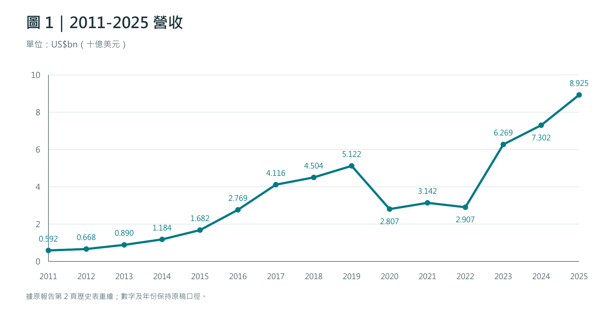
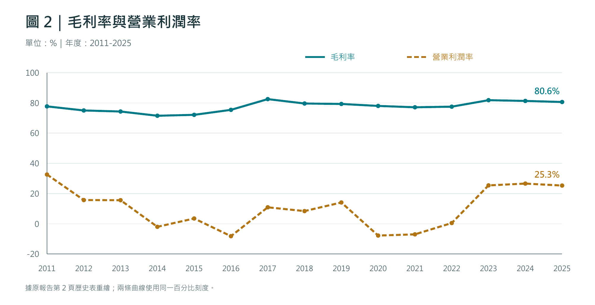
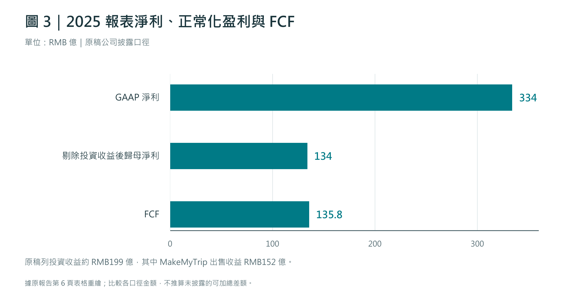

> 轉錄說明（非原報告正文）：本檔由來源 PDF「Tripcom_Munger_Value_Line_2026-09-19.pdf」的 12 頁預覽文字轉錄，修復段落、標題及表格排版，並非原始 Markdown 檔。原文、原圖題與資料表均予保留；三張圖表依原表數據重繪。來源連結按原報告來源名稱恢復；動態資料頁可能與原研究日不同。

現代版芒格 Value Line | 僅供研究，不構成投資建議 | 2026-09-19

現代版芒格 VALUE LINE · 每日公司研究

# 攜程集團 Trip.com Group

NASDAQ: TCOM · HKEX: 9961 | 研究日期：2026 年 9 月 19 日

2025 營收 RMB 624 億 同比 +17%

2025 營業利潤率 約 25.3% 核心 OTA 高毛利

2025 FCF RMB 135.8 億 FCF margin 約 21.8%

美股收市價 $40.68 2026-09-18

### 一句話結論

這是一門資產較輕、自由現金流轉化強、正在把中國 OTA 優勢向全球輸出的好生意；但「7 倍 P/E」是被 2025 年投資收益嚴重美化的表面數字。用正常化盈利看，估值更接近約 10-14 倍，仍有吸引力，但需要把監管後的酒店經濟學與海外獲客成本列為首要驗證項。

### 核心發現

- 2025 年 GAAP 淨利約 RMB334 億，但其中投資收益約 RMB199 億；公司口徑剔除投資收益後的歸母淨利約 RMB134 億。

- 2026 Q2 報表虧損主要由 RMB52 億反壟斷罰款造成；剔除罰款後季度淨利約 RMB27 億，non-GAAP 歸母淨利 RMB48 億。

- 2026 Q2 國際平台收入同比增長超過 50%，而集團總收入只增長 6%：新增長引擎已非常清楚。

- 截至 2026-06，公司現金、短期投資及定期金融產品合計 RMB1,005 億；資產負債表非常有彈性。

歷史事實、分析判斷與情景假設在正文中分開標示；所有重要數據均附原始資料鏈接。

## 1. 十五年 Value Line：先看財務痕跡，再聽故事

從 2011 到 2025，攜程經歷移動互聯網、去哪兒整合、疫情停擺與復甦。真正有價值的是看「收入、利潤率、EPS、FCF」如何穿越週期，而不是只看某一年 CAGR。

| 年 | 營收 US$bn | 毛利率 | 營業率 | 攤薄 EPS US$ | FCF US$bn |
| --- | --- | --- | --- | --- | --- |
| 2011 | 0.592 | 77.7% | 32.6% | 0.56 | 0.262 |
| 2012 | 0.668 | 75.0% | 15.7% | 0.40 | 0.178 |
| 2013 | 0.890 | 74.3% | 15.6% | 0.55 | 0.298 |
| 2014 | 1.184 | 71.5% | -2.0% | 0.13 | -0.456 |
| 2015 | 1.682 | 72.1% | 3.5% | 1.10 | 0.372 |
| 2016 | 2.769 | 75.4% | -8.2% | -0.44 | N/A |
| 2017 | 4.116 | 82.5% | 10.9% | 0.59 | 1.014 |
| 2018 | 4.504 | 79.6% | 8.4% | 0.29 | 0.938 |
| 2019 | 5.122 | 79.3% | 14.1% | 1.65 | 0.937 |
| 2020 | 2.807 | 78.0% | -7.8% | -0.83 | -0.669 |
| 2021 | 3.142 | 77.1% | -7.0% | -0.14 | 0.299 |
| 2022 | 2.907 | 77.5% | 0.5% | 0.31 | 0.308 |
| 2023 | 6.269 | 81.8% | 25.4% | 2.08 | 3.013 |
| 2024 | 7.302 | 81.3% | 26.6% | 3.39 | 2.611 |
| 2025 | 8.925 | 80.6% | 25.3% | 6.82 | 1.946 |

註：歷史數據以公開財務資料的美元換算序列呈現，便於跨年觀察；不同資料商的年度匯率與 FCF 標準化方法可能造成小差異。2016 年 FCF 未找到足夠可靠的同口徑公開值，因此標示 N/A，不補值。

### 長期讀法

- 收入端：2011-2025 的長期增長很強，但疫情造成 2020-2022 明顯斷層，所以「從谷底到復甦」不能當成常態增速。

- 利潤率端：2014-2018 整合/投入期壓低營業率；2023 之後營業率回到 25% 左右，顯示規模效應與平台 economics 已重新釋放。

- EPS 端：波動遠大於核心營業利潤，原因包括投資收益、公允價值與疫情；2025 的 US$6.82 尤其不能直接拿來估值。

- FCF 端：疫情後 2023-2025 FCF 顯著恢復，證明旅遊平台的物理資本需求很低；但營運資金與投資組合會令年度現金流有波動。

來源：[Trip.com 2025 20-F（SEC）](https://www.sec.gov/Archives/edgar/data/1269238/000119312526183379/d27369d20f.htm)

來源：[Macrotrends - Trip.com revenue / margin / EPS / FCF historical series](https://www.macrotrends.net/stocks/charts/TCOM/trip-group/revenue/1000)

## 2. 長期趨勢：收入恢復了，但「利潤品質」比增速更重要

**圖 1｜2011-2025 營收：疫情是結構性斷層，不應把 2022 谷底作為正常 CAGR 起點。**

**圖 2｜毛利率與營業利潤率：毛利率長期約 75%-82%；2023 後營業率顯著提升。**

### 股價：市場對旅遊復甦已經先樂觀、再快速去估值

- 2023、2024 業績恢復後，股價在 2024 年大幅上漲；2026 年初曾創約 US$78.96 高位。

- 截至 2026-09-18 收 US$40.68，較年初高位回撤接近一半。這種回撤不能自動等同「便宜」，但令正常化盈利估值重新進入可研究區間。

### 最重要的會計提醒

2025 年「淨利暴增」不是純粹來自 OTA 主業。MakeMyTrip 股權出售帶來 RMB152 億投資收益；若用 GAAP EPS 計 P/E，會把一次性資產變現當成永久盈利能力。

來源：[CompaniesMarketCap - Trip.com stock price history](https://companiesmarketcap.com/trip-dot-com/stock-price-history/)

來源：[StockAnalysis - TCOM current statistics](https://stockanalysis.com/stocks/tcom/statistics/)

## 3. 生意到底怎麼賺錢：不是「賣旅遊」，而是做交易入口

攜程不需要擁有大多數酒店、飛機或景區資產。核心是把供應商庫存、價格、支付、客服與流量聚合起來，在每筆交易中收取佣金、服務費或價差。這使它同時具備高毛利與低固定資產需求。

| 2025 業務 | 收入 | 收入佔比 | 經濟邏輯 |
| --- | --- | --- | --- |
| 住宿預訂 | RMB261 億 | 約 42% | 佣金/服務費；供應密度與轉化率最重要 |
| 交通票務 | RMB225 億 | 約 36% | 票務服務、交叉銷售；相對低 take rate |
| 旅遊度假 | RMB47 億 | 約 7% | 打包產品與供應鏈組織 |
| 商旅管理 | RMB28 億 | 約 5% | 企業客戶、差旅管理與服務費 |
| 其他 | 約 RMB63 億 | 約 10% | 廣告、金融/其他旅遊相關服務等 |

### 粗略單位經濟

1. GMV / 預訂額：2025 核心 OTA gross bookings 約 RMB1.1 萬億元。

2. 收入 / 預訂額：用 RMB624 億收入粗除，得到約 5.7%。這只能當「方向性 monetization」而非統一 take rate，因為住宿、交通、度假等收入確認口徑不同。

3. 毛利：2025 成本約佔收入 19%-20%，因此平台毛利率約 80%。

4. 最重的兩項費用：產品開發與銷售營銷，2025 各約佔收入 24%。這兩項決定海外增長是否會真正變成股東回報。

### 飛輪

更多供應 -> 更完整價格/庫存 -> 更高用戶轉化與復購 -> 更多訂單密度 -> 對酒店/航司更重要 -> 更容易獲得供應與商業化機會 -> 反過來強化用戶體驗。

來源：[攜程 2025 全年業績公告](https://investors.trip.com/zh-hant/news-releases/news-release-details/tripcom-group-limited-reports-unaudited-fourth-quarter-and-5)

## 4. 護城河：數據支持什麼，又反駁什麼？

| 護城河 | 強度 | 財務/經營證據 | 反證或限制 |
| --- | --- | --- | --- |
| 供應規模與密度 | 高 | 長期約 80%毛利率、住宿/交通雙入口；用戶可以一次完成整個行程。 | 監管要求可能削弱平台對酒店的部分條款與議價方式。 |
| 品牌 / 信任 / 服務 | 中高 | 高客單旅遊交易對售後、退款、跨境客服要求高；服務能力比純比價更難複製。 | Google/AI agent 可降低搜尋入口的稀缺性。 |
| 網絡效應 | 中 | 供應與需求雙邊規模提高轉化與供應商曝光價值。 | 不是社交網絡式強鎖定；用戶可以同時使用多個 OTA。 |
| 數據與技術 | 中高 | 推薦、動態排序、客服和跨語言服務可提高轉化率。 | AI 模型能力逐步商品化，真正差異仍取決於私有交易/供應數據。 |
| 資本效率 | 高 | CapEx 很低、FCF 長期強；擴張主要靠軟體、內容、營銷與運營。 | 海外流量若需要長期補貼，會把輕資產變成「重營銷」。 |

### 2026 年監管事件是一個真正的 moat 壓力測試

- Q2 住宿收入 RMB65.8 億，同比 +6%，但公司明確披露受到監管相關 contra-revenue 影響。

- 反壟斷罰款本身是一次性會計項，但整改對酒店合作條款、保證金與價格機制的影響可能是持續性的。

- 因此未來 4-6 個季度最值得看的不是「罰款是否結束」，而是住宿 take rate、住宿收入增速與銷售費用率是否惡化。

### 判斷

攜程有真實護城河，但不是無敵的「自然壟斷」。其優勢更像規模、供應密度、服務與品牌的組合；監管正在測試其中「平台規則/議價權」那一部分究竟有多少可持續性。

來源：[攜程 2026 Q2 / H1 官方業績](https://investors.trip.com/news-releases/news-release-details/tripcom-group-limited-reports-unaudited-second-quarter-and-4)

## 5. 利潤增長拆解：2025 看起來翻倍，實際主業沒有翻倍

**圖 3｜2025 報表淨利、正常化盈利與 FCF：投資收益令 reported profit 顯著高於主業。**

| 項目 | 數字 | 變化/說明 | 性質 |
| --- | --- | --- | --- |
| 2025 營收 | 約 RMB624 億 | +17% | 主業增長 |
| 2025 營業利潤 | 約 RMB158 億 | +11% 左右 | 規模效應仍在，但慢於收入 |
| 2025 GAAP 淨利 | 約 RMB334 億 | 接近翻倍 | 被投資收益顯著推高 |
| 投資收益 | 約 RMB199 億 | 其中 MakeMyTrip 出售收益 RMB152 億 | 非經常性 |
| 剔除投資收益後歸母淨利 | 約 RMB134 億 | 公司披露口徑 | 更適合作為正常化起點 |
| 2025 FCF | RMB135.8 億 | FCF margin 約 21.8% | 與正常化盈利非常接近 |

### 2026 Q2：反過來，報表又把主業看得太差

- Q2 總收入 RMB156.6 億，同比 +6%；國際平台收入同比 >50%。

- SAMR 反壟斷罰款 RMB52 億，使 G&A 一次性升至收入 40%；剔除罰款後 G&A 只佔約 7%。

- 報表淨虧損 RMB24 億；剔除罰款後淨利約 RMB27 億；non-GAAP 歸母淨利 RMB48 億，同比約 -4%。

### 所以估值要兩次「去噪」

2025 要把投資收益拿掉；2026 Q2 要把一次性罰款拿掉。單看 TTM GAAP P/E，幾乎必然得出錯誤結論。

## 6. 現金流、ROIC 與資產負債表：輕資產是真的，但標準 ROIC 被現金和商譽稀釋

| 指標 | 數字 | 如何理解 |
| --- | --- | --- |
| 2025 經營現金流 | RMB143.8 億 | 主業現金產生能力 |
| 2025 CapEx | 約 RMB8.0 億 | 僅約收入 1.3%，非常輕資產 |
| 2025 FCF | RMB135.8 億 | 約 94% 的 OCF 在 CapEx 後留下 |
| 2026-06 現金+短投+定期金融產品 | RMB1,005 億 | 提供巨大資本配置彈性 |
| 2026-06 短期+長期債務 | 約 RMB264 億 | 相對現金非常低 |
| 2026-06 Goodwill | RMB622 億 | 佔總資產約 24%，歷史併購留下的資本 |
| 標準化 TTM ROIC（資料商口徑） | 約 7.6% | 被巨額現金、投資與 goodwill 拉低 |

### 為什麼 ROIC 不能只抄一個數字？

- 如果把 RMB1,000 億左右現金/低風險金融資產全部放在 invested capital 分母，平台主業的回報率會被低估。

- 反過來，不能把 RMB622 億 goodwill 全部忽略：它代表去哪兒等歷史整合確實消耗過真實股東資本。

- 因此更重要的是「增量 ROIC」：未來海外平台每新增一元營銷、技術與供應投入，能帶來多少可持續 FCF。現階段公開數據不足以給出可信的精確增量 ROIC，應持續驗證而不是編造。

### Owner Earnings 角度

2025 正常化歸母淨利約 RMB134 億，而 FCF 約 RMB136 億，兩者非常接近。對一個有大量投資資產與非經常性損益的公司，這種現金對照比 headline EPS 更有信息量。

來源：[StockAnalysis - cash flow statement](https://stockanalysis.com/stocks/tcom/financials/cash-flow-statement/)

來源：[攜程 2026 Q2 balance sheet](https://investors.trip.com/news-releases/news-release-details/tripcom-group-limited-reports-unaudited-second-quarter-and-4)

## 7. 資本配置：從「買資產」轉向「賣投資 + 回購 + 股息」

| 動作 | 規模 | 芒格式解讀 |
| --- | --- | --- |
| 出售 MakeMyTrip 股權 | 約 US$30 億對價；確認 RMB152 億收益 | 釋放長期投資價值，同時降低資產複雜度 |
| 股票回購 | 2025 現金支出約 RMB44 億 | 若在合理估值下持續，能提高每股內在價值 |
| 股息 | US$0.30/ADS；總額約 US$2 億 | 開始建立規律性資本回報政策 |
| 還債 | 2025 net debt repaid 約 RMB91 億 | 資產負債表進一步去槓桿 |
| 股數 | 2025 年末 outstanding 649.6m；近期資料約 629.7m | 真正淨股數正在下降，而不只是宣佈回購 |

### 這一章最值得給管理層加分的地方

- 出售 MakeMyTrip 不是為了把一次性收益包裝成「經營增長」；從資本配置角度，它把一項流動性較低的股權投資變回可分配現金。

- 回購與股息必須和估值一起看。若正常化 P/E 在十幾倍，回購的 earnings yield 相對有意義；若未來估值重新回到極高水平，同樣的回購就未必划算。

- 股份數量是最終驗證。2025 年末 649.6m 股，近期資料約 629.7m，顯示回購至少在淨額上沒有被股權激勵完全抵消。

### 仍需扣分：歷史併購留下大量 goodwill

- Goodwill 約 RMB622 億，提醒投資者：攜程不是天然從零長成的純有機平台，歷史整合也用了大量資本。

- 未來若再次進行大型收購，應用收購價 / 後續 FCF 與增量 ROIC 來評估，而不是只看 GMV 或收入是否變大。

來源：[Trip.com 2025 20-F - MakeMyTrip disposal / capital return](https://www.sec.gov/Archives/edgar/data/1269238/000119312526183379/d27369d20f.htm)

## 8. 同行比較：Booking 是質量標杆；同程更接近中國本土估值參照

| 公司 | 毛利率 | 營業率 | FCF Margin | ROIC | 估值概覽 | 關鍵差異 |
| --- | --- | --- | --- | --- | --- | --- |
| Trip.com | 約 80% | 約 16% TTM\* | 約 21% | 約 7.6%\* | 約 7.6x GAAP / 正常化約 10-14x | 淨現金、國際收入高增 |
| Booking Holdings | 高 80%+ | 約 35% | 約 34% | 約 60%+\*\* | 約 19x | 全球住宿平台 economics 最成熟 |
| Expedia | 約 88% | 約 17% | 約 28% | 約 26%\*\* | 約 18x | 規模大，但利潤率/ROIC 低於 Booking |
| 同程旅行 | 約 65%+ | 約 18% | 約 17% | 約 18%\* | 約 9x | 中國大眾/微信流量優勢，估值同樣偏低 |

\* 資料商標準化 TTM 口徑；Trip.com 2026 Q2 罰款會壓低 TTM 營業率。\*\* ROIC 方法在不同資料源間差異較大，只用作方向性對照，不把小數點視為精確可比。

### 真正的比較結論

- Booking：商業模式最接近「極高資本效率的全球旅遊收費站」。它證明 OTA 可以做到 30%+ 營業率與非常高的資本回報。

- Trip.com：相對估值低很多，但折價不是免費午餐；中國監管、投資資產、歷史 goodwill，以及海外擴張需要較高營銷投入。

- 同程：估值同樣低，且本土流量效率突出；但 Trip.com 的國際化、供應深度、品牌組合與高端/跨境能力更完整。

- 因此主公司的「便宜」只有在國際業務能逐步接近成熟 OTA economics、且國內整改不永久壓低住宿 monetization 時才真正成立。

來源：[Booking Holdings statistics](https://stockanalysis.com/stocks/bkng/statistics/)

來源：[Expedia statistics](https://stockanalysis.com/stocks/expe/statistics/)

來源：[Tongcheng Travel statistics](https://stockanalysis.com/quote/hkg/0780/statistics/)

## 9. 估值：最便宜的數字，恰恰是最不能直接用的數字

| 估值指標 | 目前值 | 應如何讀 |
| --- | --- | --- |
| 股價（2026-09-18） | US$40.68 | 市場價格 |
| 市值 | 約 US$256 億 | 基於近期股數 |
| Enterprise Value | 約 US$179 億 | 巨額淨現金使 EV 明顯低於市值 |
| TTM GAAP P/E | 約 7.6x | 被 2025 投資收益美化，不適合作為核心估值 |
| P/FCF | 約 12.6x | 比 headline P/E 更有參考性，但年度 FCF 也有營運資金波動 |
| EV/FCF | 約 8.7x | 反映淨現金後估值更低 |
| Forward P/E（市場口徑） | 約 10.4x | 屬預測，不是歷史事實 |

### 正常化盈利情景（分析假設，不是公司指引）

| 情景 | 正常化年盈利 | 粗略市盈率 | 需要發生什麼 |
| --- | --- | --- | --- |
| 保守 | RMB130 億 | 約 14x | 國內 monetization 承壓、海外投入保持高位 |
| 基準 | RMB155 億 | 約 12x | 核心盈利正常增長，國際業務逐步貢獻 |
| 偏樂觀 | RMB175 億 | 約 10-11x | 海外高增同時費用率受控 |

估算使用近期市值和人民幣/美元換算的約數，目的不是給目標價，而是回答「目前價格隱含的盈利要求」。

### 估值結論

目前更接近「好生意 + 有折價」而不是「極端錯價」。如果未來正常化盈利只能維持約 RMB130 億，回報主要依靠 FCF yield、回購和溫和增長；如果國際業務能在不犧牲費用率的情況下持續 30%-50% 增長，今天的 EV/FCF 就會顯得很低。

來源：[StockAnalysis - TCOM valuation & statistics](https://stockanalysis.com/stocks/tcom/statistics/)

## 10. 什麼會打破投資邏輯？以及真正該盯的 5 個 KPI

### 主要風險

1. 監管後的住宿經濟學：一次性罰款不是核心風險，真正風險是平台規則改變後，take rate、供應商議價與轉化率永久下降。

2. 海外增長變成「買流量」：國際收入 >50% 增長很漂亮；若銷售營銷費用同步甚至更快增長，增量 ROIC 可能遠低於中國成熟業務。

3. AI / 搜尋入口被重新分配：AI agent、Google、航空/酒店直訂可能把「旅遊搜尋」變得更便宜，削弱 OTA 流量入口價值；攜程的供應、客服與履約層才是更持久的部分。

4. 旅遊週期與地緣事件：航油、簽證、航班運力、匯率與地緣衝突都會快速影響跨境旅遊。

5. 資本配置重新變差：若巨額現金再次流向高溢價併購，而非高 ROIC 有機增長/合理價回購，股東回報可能被稀釋。

### 每季只盯這 5 個數字

| KPI | 為什麼比普通 Revenue Growth 更重要 |
| --- | --- |
| 1. 國際平台收入增速 | 驗證全球化是否仍是第二曲線；>30% 且持續比集團快才有意義。 |
| 2. Sales & Marketing / Revenue | 海外增長是否靠補貼；若收入高增但費用率持續上升，要下調增量 ROIC。 |
| 3. 正常化營業利潤率 | 剔除罰款/投資公允價值後看主業；整改後若掉出 20%+ 區間需重新評估 moat。 |
| 4. FCF / Share | 把現金轉化與回購同時納入，最接近股東真正得到的複利。 |
| 5. Fully diluted share count | 驗證回購是否真的創造每股價值，而不是被 SBC 抵消。 |

來源：[Trip.com 2026 Q2 official results](https://investors.trip.com/news-releases/news-release-details/tripcom-group-limited-reports-unaudited-second-quarter-and-4)

## 11. 芒格式結論：這是不是一門好生意？現在值得研究嗎？

### 生意質量：好

高毛利、低 CapEx、強 FCF、雙邊供應規模與服務能力都是真實的。疫情後營業率回到 25% 左右，說明平台經濟並沒有被永久破壞。

### 再投資跑道：有，但需要驗證

國際平台 2026 Q2 收入同比 >50%，提供了很大的再投資空間；但真正的關鍵不是收入，而是海外 CAC、營銷費用率與成熟後的 incremental ROIC。

### 資產負債表：強

2026-06 現金、短投與定期金融產品合計 RMB1,005 億，遠高於有息債務。這給回購、投資與週期低谷提供很大安全墊。

### 價格：合理偏吸引，不是因為 7 倍 P/E

用 2025 正常化盈利和 2026 H1 的核心盈利 run-rate 粗略交叉驗證，正常化 P/E 約 10-14 倍更合理。加上淨現金後 EV/FCF 更低；這是值得高優先級深入研究的價格區間，但仍需確認整改後住宿 economics。

芒格式問題：如果交易所關閉 5 年，我最想確認的是「國際平台能否像中國成熟業務一樣，把規模轉化為高 FCF，而不是永久高營銷費用」。

### 主要原始資料 / 深度資料

- [攜程 2026 Q2 / H1 官方業績](https://investors.trip.com/news-releases/news-release-details/tripcom-group-limited-reports-unaudited-second-quarter-and-4)

- [攜程 2025 全年官方業績](https://investors.trip.com/zh-hant/news-releases/news-release-details/tripcom-group-limited-reports-unaudited-fourth-quarter-and-5)

- [Trip.com 2025 Form 20-F - SEC](https://www.sec.gov/Archives/edgar/data/1269238/000119312526183379/d27369d20f.htm)

- [StockAnalysis - TCOM statistics / valuation](https://stockanalysis.com/stocks/tcom/statistics/)

- [StockAnalysis - TCOM cash flow](https://stockanalysis.com/stocks/tcom/financials/cash-flow-statement/)

- [Macrotrends - TCOM long-term revenue series](https://www.macrotrends.net/stocks/charts/TCOM/trip-group/revenue/1000)

- [CompaniesMarketCap - TCOM stock price history](https://companiesmarketcap.com/trip-dot-com/stock-price-history/)

- [Booking Holdings statistics](https://stockanalysis.com/stocks/bkng/statistics/)

- [Expedia statistics](https://stockanalysis.com/stocks/expe/statistics/)

- [Tongcheng Travel statistics](https://stockanalysis.com/quote/hkg/0780/statistics/)

方法說明：歷史表使用公開報表與可靠聚合數據交叉核對；同行 ROIC 因定義不同只作方向性比較。所有「正常化盈利」「情景 P/E」「incremental ROIC」判斷均屬分析框架而非公司指引。若資料不足，報告明確標示而不補造數字。
